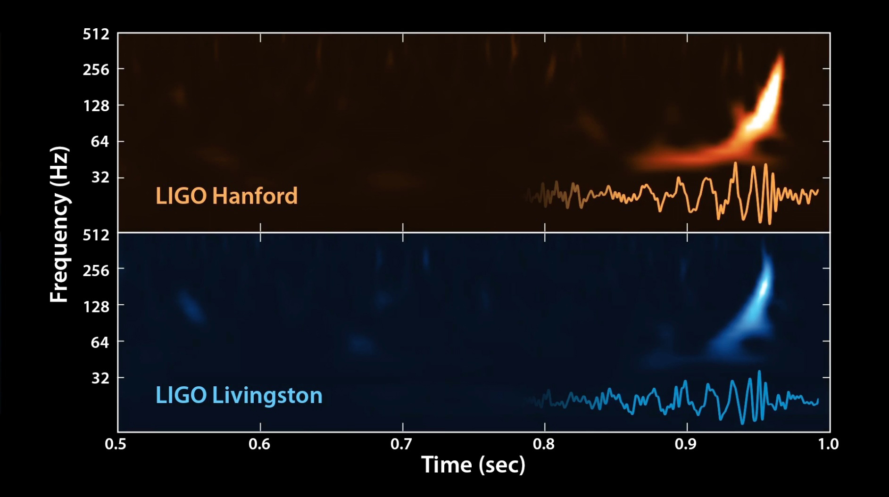

# Matrix Profile for GW Search

Traditional methods used for gravitational wave (GW) searches rely on matched filtering-based template matching based on waveforms of _modelled_ sources like binary blackhole (BBH) and binary neutron star (BNS) mergers AND a concident matching of the _same_ template in multiple detectors. There is a great interest in the gravitational wave astronomy community as well as the larger multi-messenger astronomy community to look for _unmodelled_ sources of GWs. The matrix profile (MP) has been revolutionary step forward in timeseries data mining. This is my preliminary attempt at using MP to _detect_ GW events in public **L**aser **I**nterferometer **G**ravitational-wave **O**bservatory (LIGO) data. My collaborator and I believe that the MP can serve as a fast _all-pairs of subsequences template matching_ algorithm which does not rely on modelled waveforms and is thus an unmodelled search approach.

